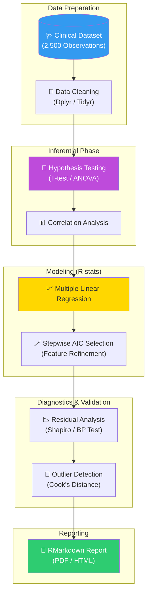
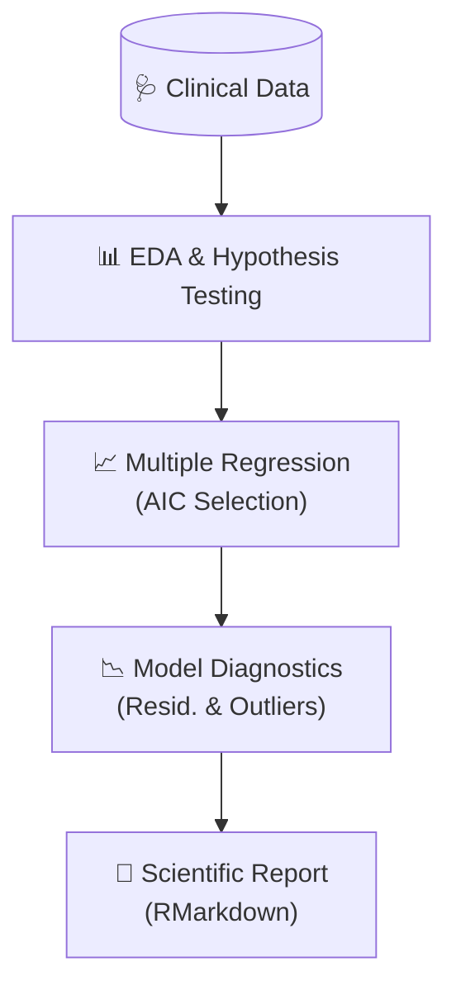

# 👶 NeoStat: Evidence-Based Statistical Modeling & Clinical Inferential Analysis

<p align="center">
  
  
  
  
  
</p>

**NeoStat** è un progetto di statistica inferenziale avanzata progettato per la modellazione dei fattori di rischio neonatale. Utilizzando il linguaggio **R**, il progetto implementa un'analisi end-to-end su un dataset clinico di **2.500 neonati**, applicando test d'ipotesi rigorosi e modelli di regressione lineare multipla per quantificare l'impatto di variabili fisiologiche e comportamentali (come il fumo materno) sul peso alla nascita.

## 🏢 Valore Enterprise & Settori di Applicazione

| Settore / Ambito | Rilevanza & Benefici |
|-------------------|-----------|
| **Public Health & Pediatrics** | Identificazione dei driver critici per la salute neonatale, supportando campagne di prevenzione basate sull'evidenza statistica. |
| **Pharmaceutical & Clinical Research** | Analisi rigorosa dei dati di studio, validazione delle ipotesi e reporting scientifico conforme agli standard di pubblicazione. |
| **Health Insurance** | Modellazione attuariale del rischio basata su variabili cliniche per la previsione dei costi sanitari pediatrici. |
| **Governmental Agencies (PA)** | Supporto al Data-Driven Policy Making per il miglioramento dei servizi di ostetricia e ginecologia territoriali. |

---

## 🎯 Executive Summary & Valore di Business
NeoStat risolve la sfida della comprensione dei nessi causali in ambito clinico, andando oltre la semplice correlazione per fornire stime precise e statisticamente significative.

### 🏛️ 1. Rigore Metodologico e Test d'Ipotesi
* **Analisi Multivariata:** Il modello non si limita a osservare singole variabili, ma gestisce la multicollinearità tra età gestazionale, BMI materno, parità e abitudini comportamentali, isolando l'effetto netto di ogni predittore.
* **Significatività Statistica:** Conferma dell'impatto negativo del fumo materno con un **p-value < 0.001**, fornendo una prova statistica inoppugnabile per il supporto alle decisioni cliniche.

### ⚙️ 2. Diagnostica del Modello e Robustezza
* **Analisi dei Residui:** Verifica sistematica delle assunzioni di linearità, omoschedasticità (test di Breusch-Pagan) e normalità (test di Shapiro-Wilk) per garantire la validità delle inferenze.
* **Cook’s Distance & Outlier Detection:** Identificazione di osservazioni influenti e outlier che potrebbero distorcere le stime, garantendo la robustezza del modello finale (**R² ≈ 0.62**).

### 🛡️ 3. Reporting Scientifico (RMarkdown)
* **Riproducibilità:** L'intero studio è documentato in RMarkdown, permettendo la generazione automatica di report tecnici completi di grafici, tabelle e analisi testuali, assicurando la trasparenza e la riproducibilità totale dei risultati.

---

## 🏗️ Architettura del Workflow Statistico



## 🛠️ Stack Tecnologico

| Layer | Tecnologia | Ruolo |
|:------|:-----------|:-----|
| 📈 **Language** | R 4.x | Statistical Computing |
| 📊 **Visualization** | ggplot2 | Advanced Scientific Plotting |
| 🧹 **Data Manipulation** | dplyr / tidyr | Tidyverse Data Cleaning |
| 🧪 **Statistical Tests** | stats / lmtest / car | Inferential Testing & Diagnostics |
| 📝 **Reporting** | RMarkdown / Knitr | Reproducible Research Reporting |

## 🚀 Setup

```r
# Installazione pacchetti necessari
install.packages(c("ggplot2", "dplyr", "lmtest", "car", "knitr", "rmarkdown"))

# Rendering del report scientifico
rmarkdown::render("Progetto previsione neonati.Rmd")
```

<br><br>

*Progettato e sviluppato da Eugenio Pasqua.*

---

# 🇬🇧 ENGLISH VERSION

# 👶 NeoStat: Evidence-Based Statistical Modeling & Clinical Inferential Analysis

<p align="center">
  
  
  
</p>

**NeoStat** is an advanced inferential statistics project designed for modeling neonatal risk factors. Using the **R** language, the project implements an end-to-end analysis on a clinical dataset of **2,500 newborns**, applying rigorous hypothesis testing and multiple linear regression models to quantify the impact of physiological and behavioral variables (such as maternal smoking) on birth weight.

## 🏢 Enterprise Value & Application Sectors

| Sector / Domain | Relevance & Benefits |
|-------------------|-----------|
| **Public Health** | Identifying critical drivers for neonatal health, supporting evidence-based prevention campaigns. |
| **Clinical Research** | Rigorous study data analysis, hypothesis validation, and publication-standard scientific reporting. |
| **Insurance** | Actuarial risk modeling based on clinical variables for pediatric healthcare cost forecasting. |

---

## 🏗️ Statistical Workflow Architecture



## 🧰 Technology Stack

`R 4.x` · `ggplot2` · `dplyr` · `lmtest` · `car` · `RMarkdown`

<br><br>

*Designed and developed by Eugenio Pasqua.*
